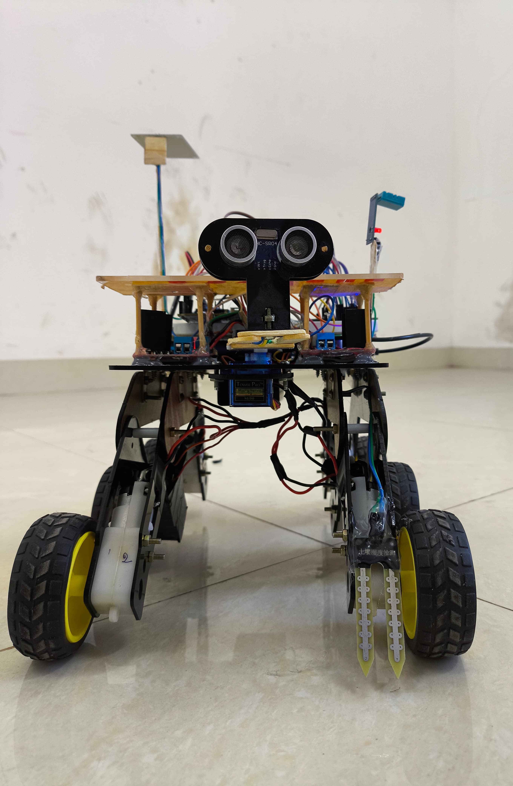
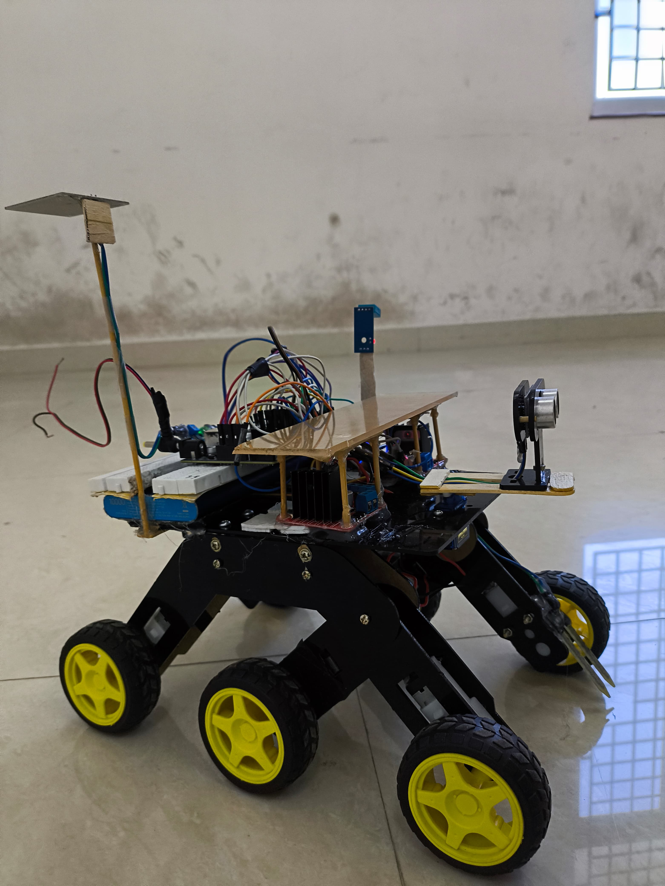
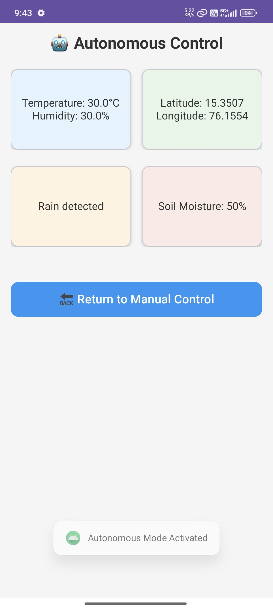
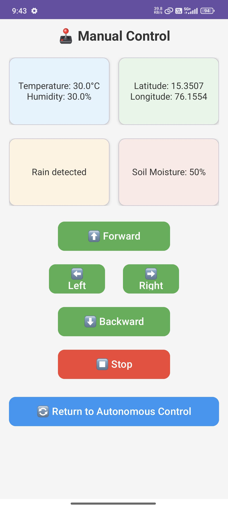
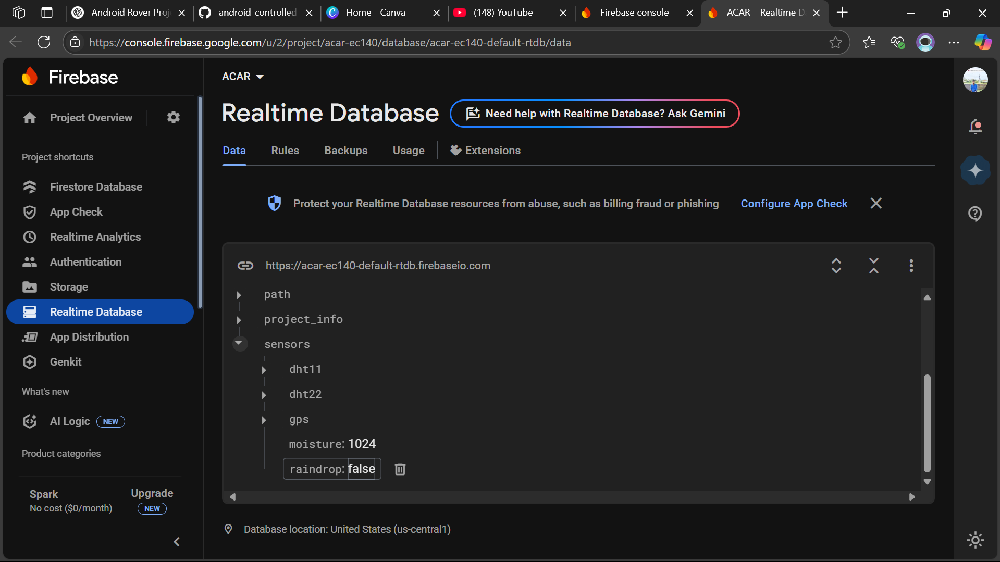

# 🤖 Android-Controlled Autonomous Rover

Final Year Mini Project - Android-controlled autonomous rover using Arduino Uno, NodeMCU, ESP32-CAM, and Firebase.

> Mini Project submitted to  
**GOVERNMENT OF KARNATAKA**  
**Government Engineering College, Talakal, Koppal-583238**  
Affiliated to **Visvesvaraya Technological University (VTU), Belagavi**  
Department of Computer Science & Engineering  
B.E. 7th Semester (2024–2025)  
Project Reference No.: **48S_BE_2879**  
Sponsored under: **KSCST Student Project Programme – 48th Series**  

---

## 👨‍🎓 Team Members

- **B Kiran**  
- **Prajwal Babalenshwar**  
- **Soujanya**  
- **Spoorti**  
**Guide:** Prof. Veeresh

---

## 📜 Project Abstract

This is our final year Computer Science & Engineering mini project, **sponsored by KSCST**, aimed at developing an **Android-controlled autonomous rover** capable of operating in both manual and autonomous navigation modes. The rover utilizes **NodeMCU (ESP8266)** for cloud connectivity, **Arduino Uno** for motor control, and an **ESP32-CAM** for real-time video streaming. Commands and sensor data are synchronized via **Firebase Realtime Database**. The rover detects environmental factors like **temperature, humidity, soil moisture, and rain**, while also avoiding obstacles autonomously using ultrasonic and infrared sensors.

---

## 🎯 Objectives

- Build a 6-wheel autonomous rover with manual control via Android app.
- Implement real-time command and data sync using Firebase Realtime Database.
- Integrate multiple sensors for autonomous navigation and environment monitoring.
- Stream live video from the rover using ESP32-CAM over Wi-Fi.
- Design an intuitive Android UI for manual/autonomous control modes.

---

## 🚗 Key Features

- 🔁 Manual and autonomous driving modes via Android app  
- ☁️ Firebase integration for real-time control and sensor sync  
- 🌡️ DHT22 sensor for temperature & humidity  
- 🌱 Soil moisture detection and rain sensing  
- 📷 Live video streaming from ESP32-CAM  
- ⚙️ 6-wheel differential drive using two L298N motor drivers  
- 🚧 Obstacle avoidance with ultrasonic and IR sensors

---

## 🔧 Hardware Used

- Arduino Uno  
- NodeMCU (ESP8266)  
- ESP32-CAM  
- 2× L298N Motor Drivers  
- 6× DC Motors (3 left + 3 right)  
- DHT22 Temperature and Humidity Sensor  
- Soil Moisture Sensor  
- Raindrop Sensor  
- Ultrasonic and IR Sensors  
- 6-wheel Rover Chassis  
- Power Bank (NodeMCU) and Batteries (Motors)

---

## 📱 Software Stack

- **Android App**: Java + XML  
- **Firebase**: Realtime Database for cloud sync  
- **Arduino IDE**: C/C++ for NodeMCU and Arduino  
- **ESP32-CAM**: For camera live feed over Wi-Fi

---

## 🧪 Methodology

1. Android app sends direction commands (`forward`, `left`, etc.) to Firebase.
2. NodeMCU reads these commands and forwards them to Arduino Uno over Serial.
3. Arduino Uno drives the motors via two L298N drivers.
4. Sensors (DHT22, Soil Moisture, Raindrop) are connected to NodeMCU and send data to Firebase.
5. ESP32-CAM streams video to a public link (YouTube/stream server).
6. App UI supports mode switching, live telemetry display, and control interface.

---

## 🎬 Demo Video

  
📺 *Click the image to watch the project demo on YouTube.*

---

## 📸 Results

  
  

  
  

  

---

## 🔮 Future Scope

- Integration with GPS for location tracking.
- Use of AI models for smarter obstacle avoidance and path planning.
- Expansion to agricultural automation and surveillance.
- Real-time alerts and notifications via app.
- Adding solar panels for sustainable power source.

---

## 📄 Project Sanction Details

- **Sanctioned By**: Karnataka State Council for Science and Technology (KSCST)  
- **Project Reference No.**: 48S_BE_2879  
- **Sanctioned Amount**: ₹4,500  
- **Institution**: Government Engineering College, Talakal  
- **Evaluation Mode**: Hardware demo with live simulation

---

## 👨‍💻 Author

**Kiran Shetty**  
📧 [bkiranshetty2003@gmail.com](mailto:bkiranshetty2003@gmail.com)  
🔗 [LinkedIn Profile](https://www.linkedin.com/in/kiranshetty23)

---

⭐ *If you liked this project, feel free to star it and share with peers interested in robotics, IoT, and embedded systems!*
